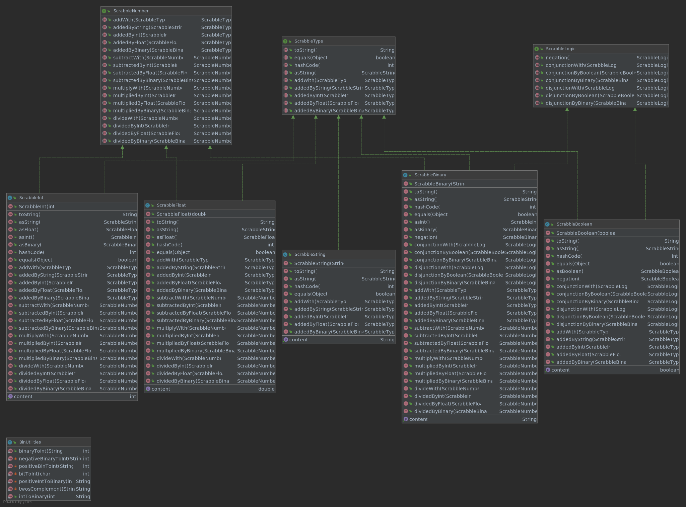

# Scrabble

Interactive graphic programming language heavily inspired by 
[Scratch](https://scratch.mit.edu).
This work is licensed under a
[Creative Commons Attribution 4.0 International License](http://creativecommons.org/licenses/by/4.0/), 
and aims purely to be used with the purpose of teaching in the context of the course 
_CC3002 Metodologías de Diseño y programación_ of the 
[_Computer Sciences Department (DCC)_](https://www.dcc.uchile.cl) of the 
_University of Chile_.

---

**The rest of the documentation is left for the users of this template to complete**

## Executing

This program contains 5 classes to instantiate objects of type ScrabbleString, ScrabbleInt, ScrabbleFloat, ScrabbleBinary and ScrabbleBoolean. The 5 classes implement the ScrabbleType interface, which determines their general behavior. In addition, ScrabbleInt, ScrabbleFloat and ScrabbleBinary implement the ScrabbleNumber interface, which determines their mathematical behavior. On the other hand, ScrabbleBinary and ScrabbleBoolean implement the ScrabbleLogic interface, which determines the logical relationships between them.

Additionally, the program has an auxiliary class called BinUtilities, which provides methods to perform transformations between binary (provided as Java String) and integers (Java int). 

## Functioning

Este programa contiene 5 clases para instanciar objetos del tipo ScrabbleString, ScrabbleInt, ScrabbleFloat,  ScrableBinary y ScrabbleBoolean. Las 5 clases implementan la interface ScrabbleType, que determina el comportamiento general de estas. Además, ScrabbleInt, ScrabbleFloat y ScrableBinary implementan la interface ScrabbleNumber, que determina su comportamiento matemático. En cambio, ScrableBinary y ScrabbleBoolean implementan la interface ScrabbleLogic, que determina las relaciones lógicas entre estas.

Adicionalmente, el programa posee una clase auxiliar llamada BinUtilities, que proporciona métodos para realizar transformaciones entre binarios (proporcionados como String de Java) y números enteros (int de Java). 

## Transformations
The 5 classes can be transformed into each other according to the following characteristics:

|                 | ScrabbleString | ScrabbleBoolean | ScrabbleFloat | ScrabbleInt | ScrabbleBinary |
|-----------------|----------------|-----------------|---------------|-------------|----------------|
| ScrabbleString  | Allowed        | Denied          | Denied        | Denied      | Denied         |
| ScrabbleBoolean | Allowed        | Allowed         | Denied        | Denied      | Denied         |
| ScrabbleFloat   | Allowed        | Denied          | Allowed       | Denied      | Denied         |
| ScrabbleInt     | Allowed        | Denied          | Allowed       | Allowed     | Allowed        |
| ScrabbleBinary  | Allowed        | Denied          | Allowed       | Allowed     | Allowed        |

Each allowed transformation can be performed with the asTYPENAME method, where TYPENAME is the name of the expected object.

## Operations

In addition to the above transformations, classes can perform some operations on each other, according to the following table:

|                 | ScrabbleString | ScrabbleBoolean | ScrabbleFloat | ScrabbleInt | ScrabbleBinary |
|-----------------|----------------|-----------------|---------------|-------------|----------------|
| ScrabbleString  |        +       |        +        |       +       |      +      |        +       |
| ScrabbleBoolean |                |       ∧,∨       |               |             |       ∧,∨      |
| ScrabbleFloat   |                |                 |    +,−,×,÷    |   +,−,×,÷   |     +,−,×,÷    |
| ScrabbleInt     |                |                 |    +,−,×,÷    |   +,−,×,÷   |     +,−,×,÷    |
| ScrabbleBinary  |                |       ∧,∨       |               |   +,−,×,÷   |     +,−,×,÷    |

This table returns the operations on the left for all those that are possible and on the right for those that are not possible. All these operations are implemented according to the Double Dispatch design pattern. Consequently, each class implements how it receives each operation. 

Operations that are not allowed according to the table, but are forced by the interface, return a null value.

## UML Diagram

