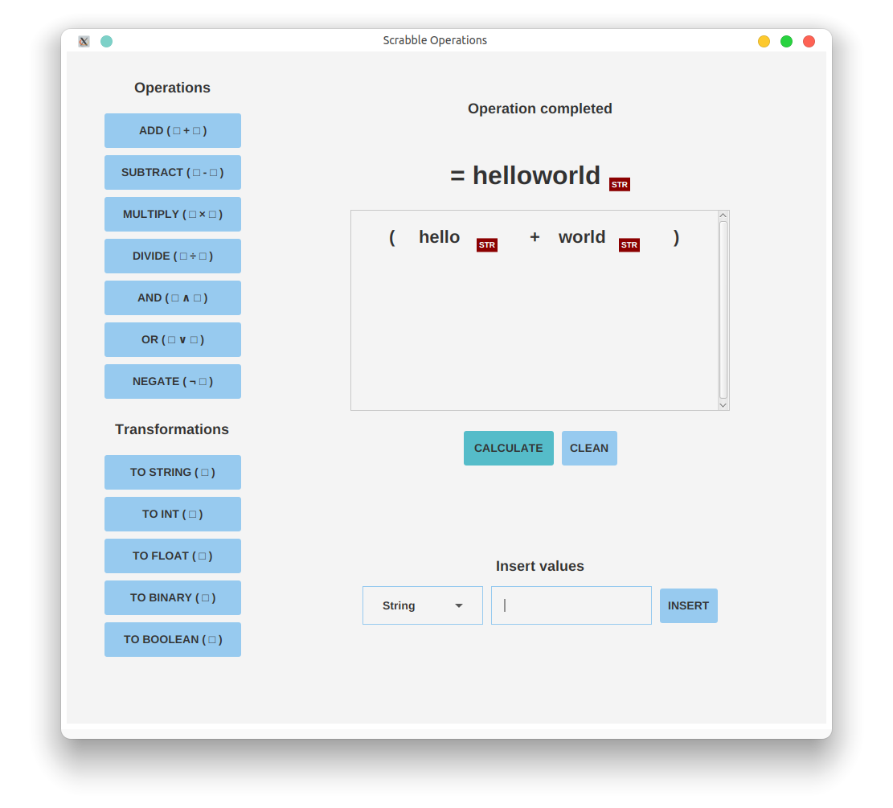
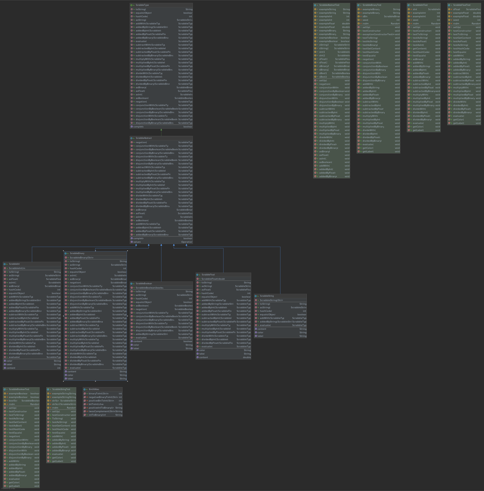
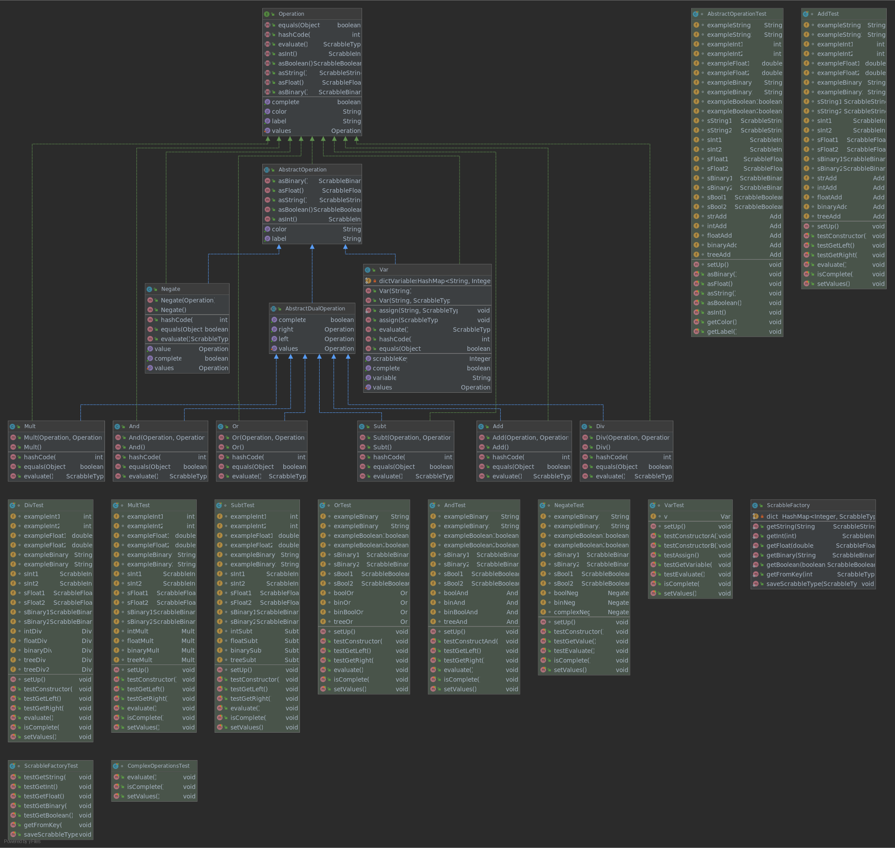

# Scrabble

Interactive graphic programming language heavily inspired by 
[Scratch](https://scratch.mit.edu).
This work is licensed under a
[Creative Commons Attribution 4.0 International License](http://creativecommons.org/licenses/by/4.0/), 
and aims purely to be used with the purpose of teaching in the context of the course 
_CC3002 Metodologías de Diseño y programación_ of the 
[_Computer Sciences Department (DCC)_](https://www.dcc.uchile.cl) of the 
_University of Chile_. Developed by Jorge Luis Ortiz Fuentes
---

## Program

This program allows to run an interface with buttons to perform operations between variables, similar but more simplified to the Scratch Project.

## Executing

This program runs on Java 15.0.1 and requires JavaFX plugin 0.0.8.

## Functioning

This program contains 3 packages: model, controller and view.

The model package contains 5 classes to instantiate objects ScrabbleString, ScrabbleInt, ScrabbleFloat, ScrabbleBinary and ScrabbleBoolean. The 5 classes implement the ScrabbleType interface, which determines their general behavior and expand an abstract class called ScrabbleAbstract. 

The controller package contains 7 classes with AVL tree operations: Add (addition), Subt (subtraction), Mult (multiplication), Div (division), And (conjunction), Or (disjunction) and Negate (negation). These classes implement the Operation interface and expand an abstract class called AbstractOperation. In addition, there is a factory to build the memory-optimized Scrabble objects.

The objects of the model package function as leaves of the AVL trees, so they also implement the Operation interface.

In addition, in the operations package there is the Var class, to assign variables of the String to the objects of the Scrabble model, using the Factory and optimizing the memory.

## Model

### Types
The 5 classes can be transformed into each other according to the following characteristics:

|                 | ScrabbleString | ScrabbleBoolean | ScrabbleFloat | ScrabbleInt | ScrabbleBinary |
|-----------------|----------------|-----------------|---------------|-------------|----------------|
| ScrabbleString  | Allowed        | Denied          | Denied        | Denied      | Denied         |
| ScrabbleBoolean | Allowed        | Allowed         | Denied        | Denied      | Denied         |
| ScrabbleFloat   | Allowed        | Denied          | Allowed       | Denied      | Denied         |
| ScrabbleInt     | Allowed        | Denied          | Allowed       | Allowed     | Allowed        |
| ScrabbleBinary  | Allowed        | Denied          | Allowed       | Allowed     | Allowed        |

Each allowed transformation can be performed with the asTYPENAME method, where TYPENAME is the name of the expected object.

### Methods

In addition to the above transformations, classes can perform some operations on each other, according to the following table:

|                 | ScrabbleString | ScrabbleBoolean | ScrabbleFloat | ScrabbleInt | ScrabbleBinary |
|-----------------|----------------|-----------------|---------------|-------------|----------------|
| ScrabbleString  |        +       |        +        |       +       |      +      |        +       |
| ScrabbleBoolean |                |       ∧,∨       |               |             |       ∧,∨      |
| ScrabbleFloat   |                |                 |    +,−,×,÷    |   +,−,×,÷   |     +,−,×,÷    |
| ScrabbleInt     |                |                 |    +,−,×,÷    |   +,−,×,÷   |     +,−,×,÷    |
| ScrabbleBinary  |                |       ∧,∨       |               |   +,−,×,÷   |     +,−,×,÷    |

This table returns the operations on the left for all those that are possible and on the right for those that are not possible. All these operations are implemented according to the Double Dispatch design pattern. Consequently, each class implements how it receives each operation. 

Operations that are not allowed according to the table, but are forced by the interface, return a null value.

## Controller

### Operations

The possible operations were implemented using AVL trees. 

The Add (addition), Subt (subtraction), Mult (multiplication), Div (division), Or (disjunction), And (conjunction) trees have two leaves. On the other hand, the Negate tree has only one leaf. 

All trees can receive both other trees and Scrabbles cl.uchile.dcc.scrabble.model objects.

### Factory

In order to optimize memory usage and make object creation efficient, a Factory was implemented. Through it you can create objects with the following methods

* ScrabbleFactory.getString(string)
* ScrabbleFactory.getInt(int)
* ScrabbleFactory.getBinary(string)
* ScrabbleFactory.getFloat(double)
* ScrabbleFactory.getBoolean(bool)

### Variables 

In order to allocate variables optimizing memory, the Var class was created to relate String variables with scrabble objects that are created and stored with the ScrabbleFactory. 

## Vist

Through a layout divided into two parts (left and right), the program allows you to insert operations, transformations and values to be calculated at the push of a button.

The view is structured in 10 classes.

* Scrabble: initializes the layout and starts the program
* DesignFactory: factory to build labels, buttons and fields in a predesigned format
* LeftBox: contains the buttons for inserting operations
* InsertOperations: functionalities for leftbox buttons to insert operations and transformations
* RightBox: contains the notifications, the result, the inserted operations and the buttons for adding objects values
* Notifications: implements a stack to store the notifications that are displayed at the top of the right box
* Result: implement and shows the result of the operation in memory
* Operations: implements the operation box in the right box 
* InsertValues: functionalities for rightbox buttons to insert objects values 
* Calculate: implements the buttons and functionalities to calculate the inserted operations and values

## Model UML Diagram

## Controller UML Diagram

## View UML Diagram

